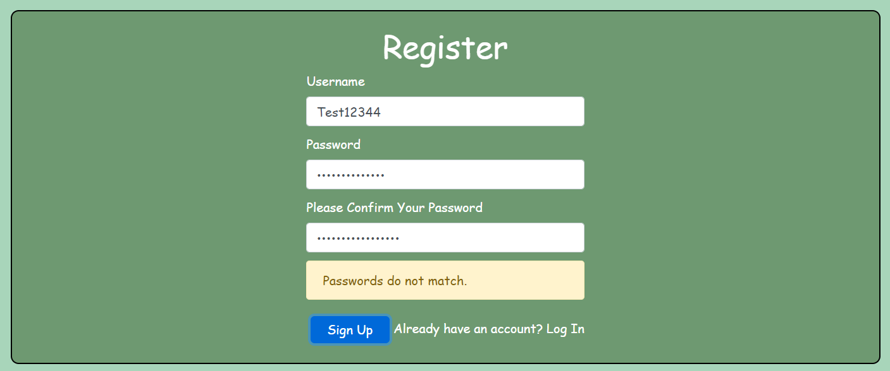
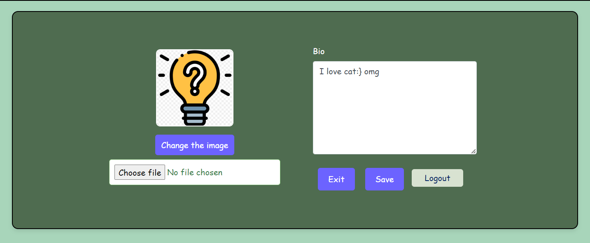
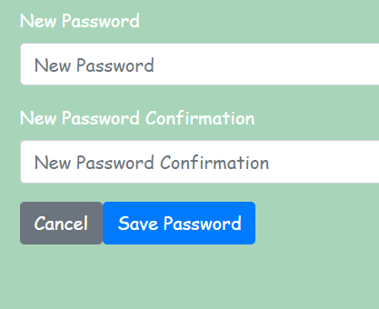
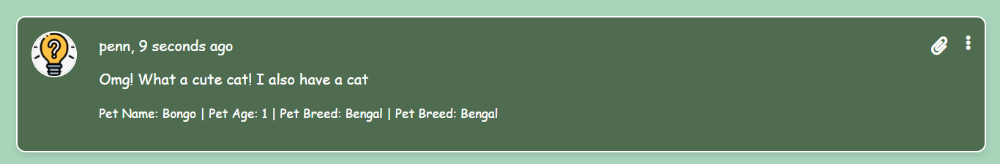

# RESUBMISSION

Snap It did not meet the standard I aspired to achieve due to a combination of time constraints and illness over Christmas I got galandular fever during my last project prior to this one and really struggled to get it out on time, at this point I did not realize I would struggle with it as long as I did, after my submission of my last project I felt fine and dandy! However while working on the this project it came back! I should have requested an extension and that is my own fault as I am a hard worker and really thought it would be done on time! But with galandular came extreme tiredness which made it difficult to focus, I pushed through however my retention of knowledge was not as good so I ultimately struggled with django a lot. Unfortunately, these factors impacted the development process, resulting in certain aspects of the application not meeting the desired level of quality. Time constraints limited the amount of attention and effort I could dedicate to the project, leading to compromises in various areas such as code organization, feature completeness, and user experience. Additionally, dealing with illness further disrupted the development schedule, reducing productivity and making it challenging to focus on implementing improvements and resolving issues effectively.

Here is the feedback I got back

## LO1 - Design an interactive Front-End web application using HTML, CSS and advanced JavaScript, based on component composition and separation of concerns

| Criterion | Meets Criterion | Reason |
|-----------|-----------------|--------|
| 1.1 | No | UX/UI issues present that severely restrict the user’s ability to understand and/or interact with the application. |
| 1.2 | No | JSX code is used for creating a dynamic application but there are issues present with the data manipulation. |
| 1.3 | Yes | The code meets the standards of readability and follows meaningful naming convention as per the defined standards. |
| 1.4 | Yes | The aspects for cross-platform compatibility are considered as the files have been named using the defined conventions e.g., PascalCase for naming components and camelCase for naming hooks. |
| 1.5 | Yes | The deployment process is specific and detailed to the point a user following this documentation could deploy the project without referencing outside resources. Steps on how to fork or clone the project may be included. |
| 1.6 | Yes | No sensitive information exists in the code base. Environment variables and .gitignore files have been used effectively. |
| 1.7 | Yes | React components have been used to implement modular functionality. There are separate JS and CSS files for different components in the codebase. |
| 1.8 | Yes | Functional and/or Class components have been used to build the application. |
| 1.9 | Yes | Minor UI responsive issues are present on different device sizes, however the application is usable across a range of device sizes. |
| 1.10 | Yes | Most user interactions in the application are handled effectively, however there are some inconsistencies in certain interactions due to mishandled events in the code base. |
| 1.11 | Yes | Most user actions run without issues in the application, however some actions may be encumbered by UI issues and/or do not produce expected results. |
| 1.12 | No | Manual testing steps are missing or lacking in any meaningful detail for the Front-End application. |
| 1.13 | Yes | Git usage is consistent, atomic commits have been made and commit messages clearly indicate the individual code change/documentation update being made within the commit. |
| 1.14 | Yes | The application is deployed successfully to a hosting platform such as Heroku and matches up to submitted content. |

Additional Notes:
- The application has a simple interface but is shipped with multiple functionality issues. For instance, UX/UI issues are prevalent such as lack of error messages on mismatched passwords in signup form, missing error messages on incorrect password entry in sign-in form, and "Page not found!" errors after logging in to edit profile options. Additionally, comment forms lack user feedback and unnecessary data fields are required without display purpose. Contrast issues and lack of testing details in the front-end readme are also noted.

## LO2 - Explain the key role that specialist Front-End developers perform in modern software development/delivery teams

| Criterion | Meets Criterion | Reason |
|-----------|-----------------|--------|
| 2.1 | Yes | Good understanding of React architecture displayed by the documentation of the reuse of React components. |
| 2.2 | Yes | The design process and its reasoning are documented, but could be improved. |
| 2.3 | Yes | A general description is present of the intention for the application. |
| 2.4 | Yes | User stories are present, but are not aligned specifically to project goals. |
| 2.5 | Yes | Agile methodologies have been implemented, however they can be expanded on. For example, by segmenting the development process into sprints with a dedicated GitHub project for each sprint. Additionally, user stories can be prioritized following the MoSCoW method through the use of GitHub labels and clear acceptance criteria identified for each issue. |
| 2.6 | Yes | The use of Front-End libraries is documented in the README, including the values provided by these libraries. The choices are well justified. |

Additional Notes:
- The readme documents the component reusability for this application. The project purpose is included, and the user stories have been aligned accordingly. However, it would be beneficial to explicitly identify the project goals and map the user stories to these goals. 
- The design documentation contains the color scheme and typography details, but wireframes are missing. Including wireframes for different pages and screen sizes would enhance clarity.
- The libraries used for this application are listed along with the reasoning behind their selection.
- Agile development tools such as GitHub issues and project board are used for project management, but there is room for improvement. User stories lack defined tasks and acceptance criteria, and labels are not created using the MoSCoW method to prioritize them. Milestones should be created to map epics and associate user stories with them. User stories marked as 'Done' in the project board should be closed in GitHub issues for clarity and completeness.

## LO3 - Create an Application Programming Interface (API) for consumption by 3rd party applications

| Criterion | Meets Criterion | Reason |
|-----------|-----------------|--------|
| 3.1 | Yes | The backend has been developed using the Django Rest Framework, which allows users to store and manipulate data records. |
| 3.2 | Yes | There is scope for further customization on the existing custom Django models. |
| 3.3 | Yes | Modest attempt to follow code standards with minor inconsistencies (e.g., not all functions contain docstrings, some long lines, etc.). |
| 3.4 | Yes | Demonstration of excellence displayed by custom code implementation of Python logic and idioms. |
| 3.5 | Yes | The codebase includes permissions, serializers, and class-based views. |
| 3.6 | Yes | The database schema for the application indicates a good understanding of the creation of related database models and their roles in REST API development. |
| 3.7 | Yes | CRUD operations are well-implemented for the API records. Users can perform Create, Update, and Delete operations for the frontend for models on the backend without issues. |
| 3.8 | Yes | Users can register and login to the application without issues. |
| 3.9 | Yes | Users are unable to effect changes to the database beyond the permissions assigned to them. |
| 3.10 | Yes | A full set of manual tests is present to indicate how all aspects of the Back-End application were tested to ensure good working order. Individual testing steps are detailed, along with actual outcomes of tests. |
| 3.11 | Yes | Git usage is consistent, atomic commits have been made, and commit messages clearly indicate the individual code change/documentation update being made within the commit. |
| 3.12 | Yes | The application has been deployed successfully to a cloud-based hosting platform where it is running without issues and matches the submitted content. |
| 3.13 | Yes | Environment variables have been used to hide all sensitive information from the final code. |
| 3.14 | Yes | The deployment process is present and detailed to the extent that a user could deploy the project based on the information provided without having to consult an alternate resource. |

Additional Notes:
- The backend of the application utilizes the Django Rest Framework, enabling seamless user registration and login functionality. Multiple models support data storage and manipulation operations on the UI, demonstrating a good understanding of database principles.
- Security aspects are well considered, with sensitive information like secret keys hidden using environment variables. The readme effectively documents the testing and deployment process, reflecting high-quality standards for the project.

## LO4 - Create an Interactive Front-End application that consumes API data

| Criterion | Meets Criterion | Reason |
|-----------|-----------------|--------|
| 4.1 | No | Expected CRUD routes are not accessible. |
| 4.2 | Yes | Appropriate notifications and/or automatic redirects implemented to inform users of successful CRUD operations. |
| 4.3 | No | API data is not displayed effectively on the front end, or is not manipulatable, such as to severely hamper user experience. |
| 4.4 | Yes | The exception handling is present for the API calls, e.g., if an API call is made for a non-existent resource, then it contains 'Not Found' in the details. |
| 4.5 | Yes | No major issues impacting functionality of the application. |
| 4.6 | Yes | At least two forms present for the enactment of CRUD functionality. Forms largely have appropriate validation with some exceptions, and/or messaging may not be clear to the users in cases of non-valid data entry. |
| 4.7 | Yes | Clear indication present to indicate login status to the user either in the main navigation or through some other UI element, such that there is no room for confusion/interpretation on behalf of the user. |
| 4.8 | Yes | No commented out code present. All links return status 200. Internal links work without issue. |

Additional Notes:
- The application successfully supports CRUD operations on the front end. However, there is a missing feature related to displaying notifications for these operations on the UI, which would provide real-time feedback to users for all data changes.
- The forms allow users to create, edit, and delete records from the UI, with proper validation checks to ensure only valid data entry. However, improvements are needed:
  - Ensure the snap creation form is accessible only to logged-in users to enhance security.
  - Validate the pet age field to accept only positive integers on the snap creation form.
- Each post displays all comments created, regardless of whether they are intended for that specific post, which may affect user experience.
- The navigation menu shows different labels based on the user's login status, which effectively indicates login status to users.

## Here is what I did to fix it

### LO1

#### 1.1 UX/UI issues present that severely restrict the user’s ability to understand and/or interact with the application.
- I ensured that error messages now display when passwords do not match on the register page, and they show when password/username is incorrect when a user is trying to log in! Along with that I changed the color scheme of the site to make it much more accessible!

#### 1.2 JSX code is used for creating a dynamic application but there are issues present with the data manipulation.
- I went through and fixed the errors in the url paths creating the problems with the page not found! Along with the information displaying on the comments... Due to the lack of functionality when I initially submitted my project I was more concerned with it actually working opposed 
to how it looked, therefore not all of the information was displayed on the comments, but I included the extra fields that are not required to submit the form as a quick fun way for users to share information with others! Opposed to making a whole snap and it displaying on their feed, something that they may not want to share with everyone and make an entire post about as it may relate to a niche interest or event!

#### 1.12 Manual testing steps are missing or lacking in any meaningful detail for the Front-End application.
- I now have a very detailed [Testing folder](./TESTING.md)

### LO2
- Quite honestly I simply ran out of time for the readme towards the end, I had my wireframes done but they were all blue, and my website is green, I was aware that I was going to fail as aspects of it simply did not work. And turning it in on time and taking the fail gave me 2 resubmission attempts, however turning it in late only gave me one resubmission attempt and both are now capped at a pass, so I went for the better option just in case but I can assure what was missing is now present in the [README](./README.md)

### LO3 
- The back-end was the first half of the project I tackled as when going through the walkthroughs that was the one I struggled with the most! I found the moments walkthrough relatively easy but when attempting it on my own, boy! Was I wrong! 

### LO4
- The snap creation form is now only accessible to logged in users, if logged out and attmepting to access the site now redirects to the login page!
- The pet age field on both the comments form and the snap creation form only accept positive integers and no alphebitical letters! Along with that it is capped at 300 years old pets due to some reptiles that live exceptionally long lives! 
- The comments issue was the main one that really slowed me down, spending time with tutor support really helped me get that sorted and now the comments are specific to the posts that they are intended for :D

